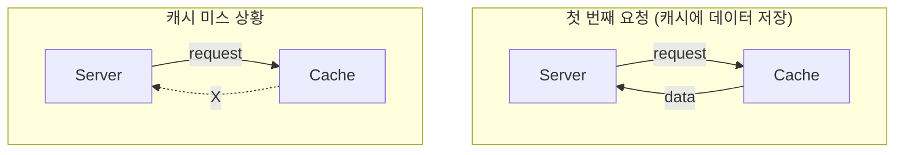
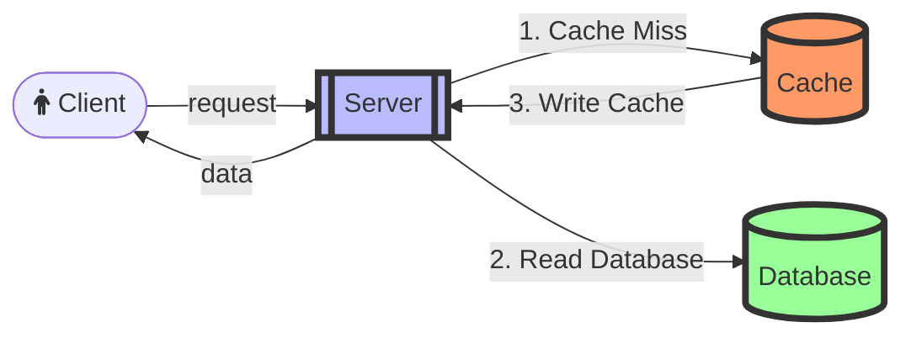

# 1. Redis 알아보기

##  Redis 란?
 - redis -> **Re**mote **Di**ctionary **S**erver
 - HashMap과 같이 O(1)의 시간복잡도를 가짐
 - 백업 데이터를 제외한 데이터를 RAM에 저장

## Redis의 특징

| 특징              | 비고                                          |
|-----------------|---------------------------------------------|
| In-Memory       | 모든 데이터를 Ram에 저장(백업 / 스냅샷 제외)                |
| Single Threaded | 단순하고 효율적                                    |
| Cluster mode    | 다중노드에 데이터 (분산안전성 & 고가용성)                    |
| Persistence     | RDB(Redis Database) + AOF(Append only file) |
| Pub/Sub         | 패턴 지원, 손쉬운 어플리케이션 개발                        |

## Redis 장점
 - 높은 성능 -> 인 메모리에 저장해 읽기/쓰기속도 보장 
 - Data Type -> 다양함
 - 다양한 언어 라이브러리 지원
 - 성숙한 커뮤니티

## 활용 사례
| 기술             | 사례                                                 |
|----------------|----------------------------------------------------|
| Caching        | OTP, session                                       |
| Rate Limiter   | Fixed Window / Sliding Window Rate Limiter(비율 계산기) | 
| message Broker | Message Queue                                      |
| 실시간 분석  계산     | 순위표 / 반경탐색(Geofencing) / 방문자 수 계산                  |

## 영속성
 - 캐시 사용
   - 기본적으로 손실되어도 무방한 데이터 사용해야됨
   - 영속성 옵션 제공 
 - RDB(Redis Database)
   - Point-in-time Snapshot -> 재난 복구(DR) or 복제
   - 생성 시 성능저하, 일부 데이터 유실 위험 
 - AOF(Append Only File)
   - Wirte 작업 Logging
   - 유실 위험은 적지만, DR시 Re-Write로 RDB보다 느림
 - RDB + AOF 함께 사용 가능한 옵션도 제공

## Caching

### 캐싱이란?
 - 데이터를 빠르게 읽고 처리하기 위해 임시로 처리하는 기술  
 - 계산값을 임시 저장 -> 동일한 요청 시 저장된 값 사용  
 - Cache = 임시 저장소 / Caching = 임시저장소를 사용하는 기술  
 
### 사용사례
| 예시          | 사례                                     |
|-------------|----------------------------------------|
| CPU         | CPU와 RAM 속도 차이 지연을 줄이기 위해 L1,L2,L3 캐싱  |
| 웹 브라우저      | 웹 페이지 데이터를 로컬 저장소에 저장                  |
| DNS         | 도메인 이름과 IP주소를 저장해 재 요청 시 사용 ex) TTL    |
| 데이터 베이스 캐싱  | 조회 혹은 계산 결과를 재요청시 사용 ex) Buffer Pool   |
| CDN         | 원본 서버 컨텐츠를 PoP 서버에 저장 -> 가까운 서버에 요청 처리 |
| Application | 데이터 혹은 계산결과 캐싱, 반복적 작업 최적화             |

## Cache Hit / Miss

### 캐시미스

### Cache-Aside pattern
 Cache Hit시  response  
 miss일시 DB에서 조회 -> 캐싱 ->  
