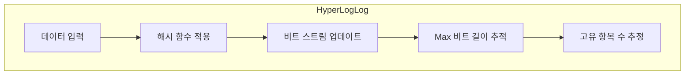

# 3. 데이터 타입 알아보기

## BloomFilter
 - element가 집합안에 포함되었는지 확인
 - 확률형 자료구조 (membership test)
 - 정확성을 포기, 저장공간 효율적으로 사용
 - false positive
   - 집합에 포함되지 않는 element를 포함되었다고 예측 하는 현상
## HyperLogLog vs Bloom Filter 내부 구조



## vs Set
 - 저장을 실질적으로 하지 않기 때문에 저장공간 효율적
 - 적은 메모리로 사용 가능
   
## 명령어
```redis
-- hyper log log set
BF.MADD fruits apple orange
BF.EXISTS fruits apple
```

