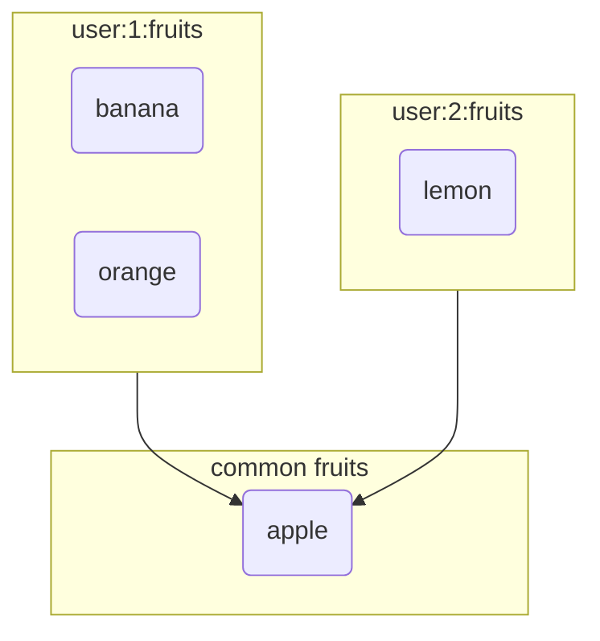

# 3. 데이터 타입 알아보기

## Sets 
 - Unique String으르 저장하는 정렬되지 않은 집합
 - Set Opreation 사용 가능 (ex. intersection, union, difference)

## 명령어
```redis

-- 중복 제거됨으로 orange 제거
SADD user:1:frutes apple banana orange orange
SADD user:2:frutes apple lemon

SMEMBERS user:1:frutes
SCARD user:1:frutes

SISMEMBER user:1:frutes banana lemon

SINTER user:1:frutes user:2:frutes
-- $ apple
SDIFF user:1:frutes user:2:frutes
-- $ banana orange
SUNION user:1:frutes user:2:frutes
-- $ lemon apple banana orange
```

