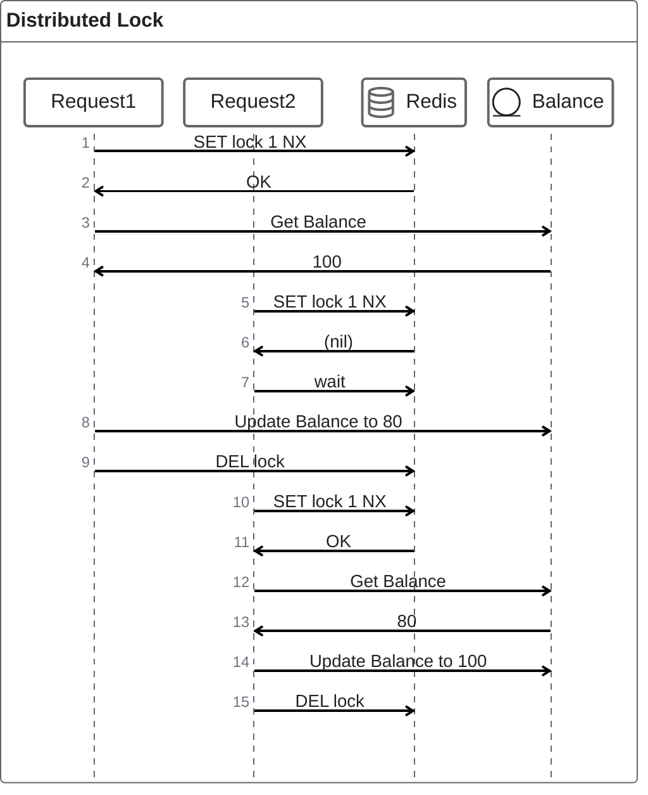

# 데이터 타입 활용

## Distributed Lock
 - 분산 환경의 다수의 프로세스에서 동일한 자원에 접근 할 시 동시성 문제 발생
   - Redis를 이용하면 해결 가능

```mermaid
zenuml
   title Distributed Lock
   @User Request1
   @User Request2
   @Database Redis
   @Entity Balance
      Request1 -> Redis: SET lock 1 NX
      Redis -> Request1: OK
      Request1 -> Balance: Get Balance
      Balance -> Request1: 100
      Request2 -> Redis: SET lock 1 NX
      Redis -> Request2: (nil)
      Request2 -> Redis: wait
      
      Request1 -> Balance: Update Balance to 80
      Request1 -> Redis: DEL lock
      
      Request2 -> Redis: SET lock 1 NX
      Redis -> Request2: OK
      Request2 -> Balance: Get Balance
      Balance -> Request2: 80
      Request2 -> Balance: Update Balance to 100
      Request2 -> Redis: DEL lock
```