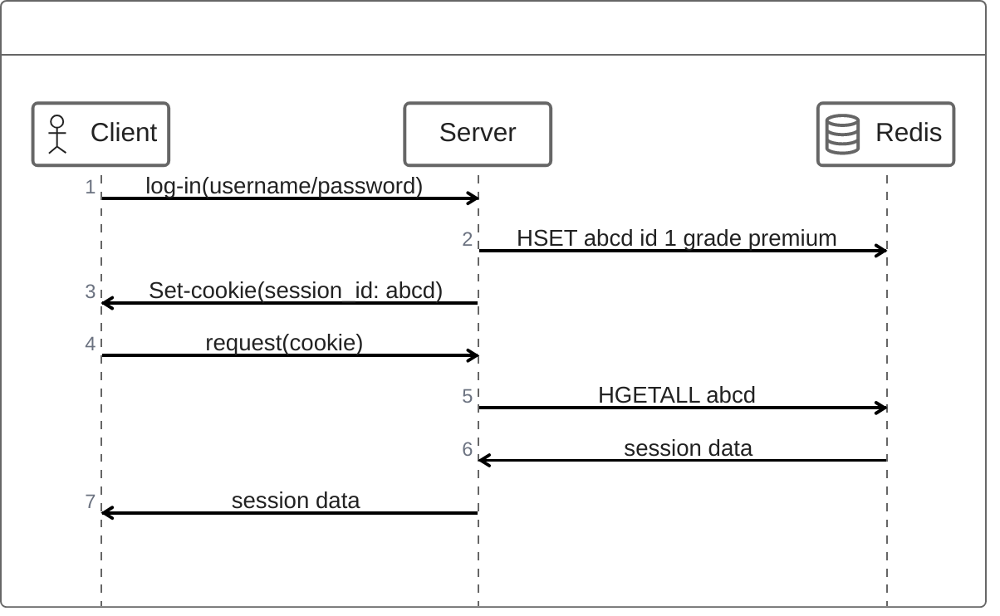

# 데이터 타입 활용

## Login Session
 - 사용자의 로그인 상태를 유지하기 위한 기술
 - 동시 로그인 제한
   - 동시 로그인 가능한 디바이스 개수 제한

```mermaid
zenuml
@Actor Client
@Server Server
@Database Redis
   Client -> Server: log-in(username/password)
   Server -> Redis: HSET abcd id 1 grade premium
   Server -> Client: Set-cookie(session_id: abcd)
   Client -> Server: request(cookie)
   Server -> Redis: HGETALL abcd
   Redis -> Server: session data
   Server -> Client: session data
```