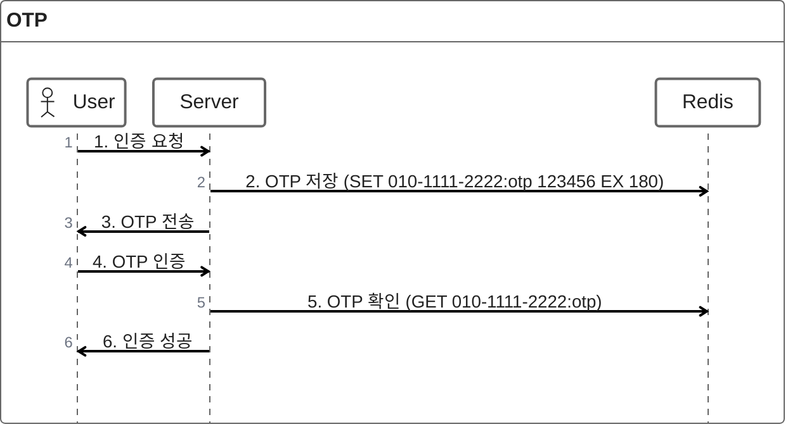

# 데이터 타입 활용

## One-Time Password
 - 인증을 위해 사용되는 임시 비밀번호(eg. 6자리 랜덤 숫자)

### 예제
SET key:번호 value:OTP TTL 180초 설정  
시간이 만료되거나 인증된 OTP로 응답이 오지 않는 경우 tlfvo

```mermaid
zenuml
    title OTP
    @Actor User
    @AzureBackup Server
    @ElastiCache Redis    
    
        User -> Server: 1. 인증 요청
        Server -> Redis: 2. OTP 저장 (SET 010-1111-2222:otp 123456 EX 180)
        Server -> User: 3. OTP 전송
        User -> Server: 4. OTP 인증
        Server -> Redis: 5. OTP 확인 (GET 010-1111-2222:otp)  
        Server -> User: 6. 인증 성공
```