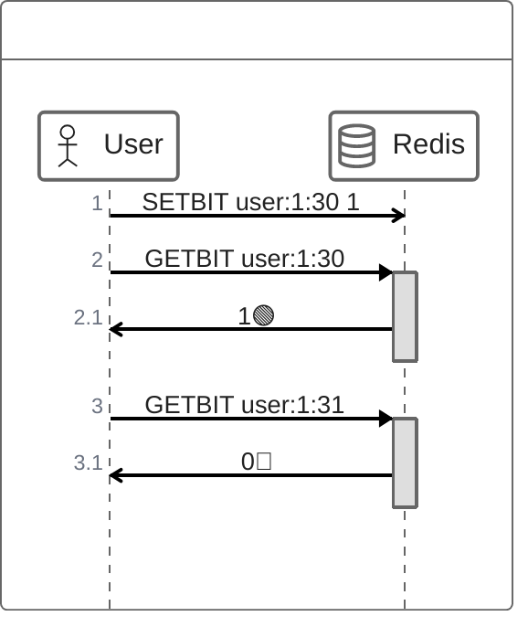

# 데이터 타입 활용

## Oneline Status
 - 사용자의 현재 상태를 표시하는 기능 (온라인 / 오프라인)
 - 실시간성 완벽히 보장 X / 수시로 변경되는 값

## 구현
 - SETBIT user:online:{userId}:{현재 시간 hh} 1
   - 서버와 network 통신 시 bit값 업데이트
 - GETBIT user:online:{userId}:{현재 시간 hh}
   - 현재 시간에 user가 online이라면 1 아니라면 0

