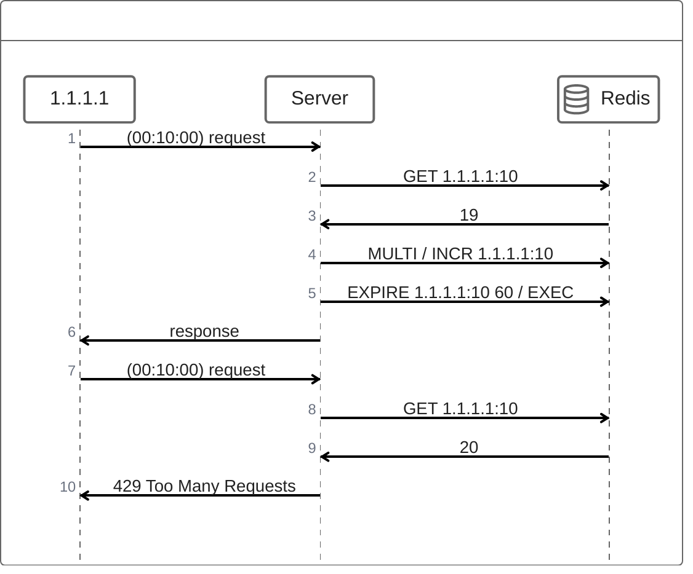

# 데이터 타입 활용

## Rate Limiter
 - 시스템 안정성 / 보안을 위해 요청의 갯수를 제한하는 기술
 - IP-Based, User-Based, Application-Base ...

## Fixed-window Rate Limiting
 - 고정된 시간(e.g. 1분)안에 요청수를 제한하는 방법

## 예제
 - IP를 기준으로 시간당 요청수 20회 제한
   - key : {IP}:{date hh}
     -  분 만 설정하는 이유 : 한시간이 지나기 전 모든값 만료
   - value : 요청 수
 - 요청의 TTL을 설정하고 요청이 들어올 떄 마다 +1 INCR
 - 최악의 경우 : 59분에 20회 요청 -> 00분에 20회 요청 시 40회 요청이 찍히는 경우가 있음 

