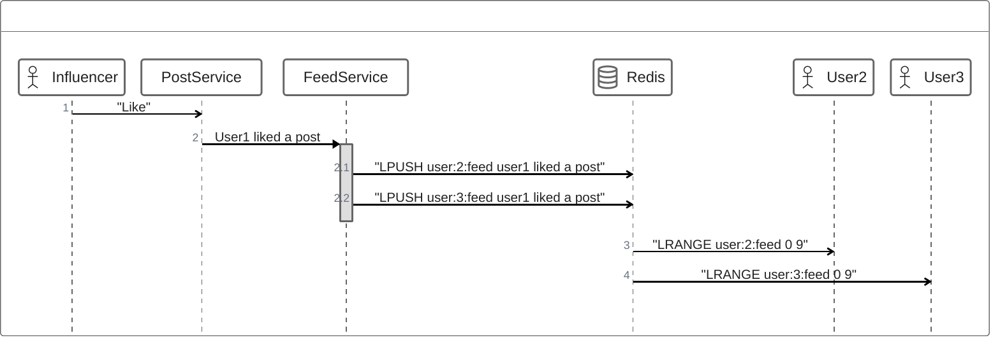

# 데이터 타입 활용

## SNS Active Feed
 - 사용자 또는 시스템과 관련된 활동이나 업데이트를 시간순으로 정렬하여 보여주는 기능

## Fan-out
 - 메세징 패턴
 - 단일 데이터를 한 소스에서 여러 목적지로 동시에 전달

## 예제
Influencer 가 Post를 발행 했을 시  
List형의 user Feed에 Post Push  

해당 Post를 User 1, 2가 읽어 0~9번째 Feed Range 에서 발행받아 읽어들인 뒤 사후처리  

