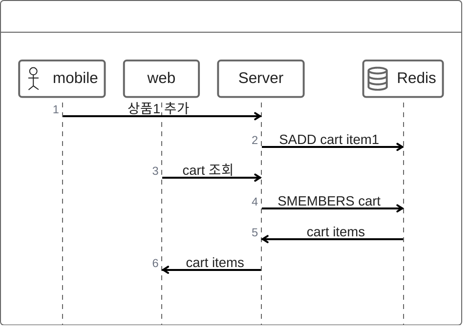

# 데이터 타입 활용

## Shopping Cart
 - 사용자가 구매를 원하는 상품을 임시로 모아두는 가상의 공간
 - 수시로 변경발생, 구매로 이어지지 않을 수 있음

## 구현
Set 형태로 구현 시 동일 상품에 중복 제거에 용이

```mermaid
zenuml
@Actor mobile web
@Server Server
@Database Redis

    mobile -> Server: 상품1 추가
    Server -> Redis: SADD cart item1
    web -> Server: cart 조회
    Server -> Redis: SMEMBERS cart
    Redis -> Server: cart items
    Server -> web: cart items
```