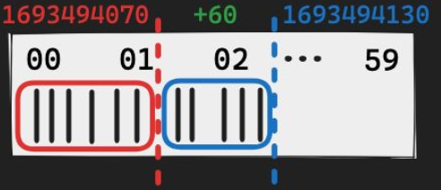
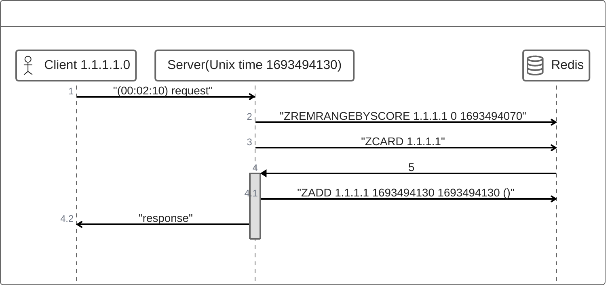

# 데이터 타입 활용

## Sliding Window Rate Limiter
 - 시간에 따라 Window를 이동시켜 동적으로 요청수 조절

## vs Fixed Window
| Sliding window             | fixed window               | 
|----------------------------|----------------------------|
| 시간이 경과함에 따라  window 이동 | Window 시간마다  허용량이 초기화 |

## 구현 방식
- Sorted Set + Unix Time(Score 대신)  
  원하는 기간 : 현재시간 - (원하는 기간) ~ 현재시간 
  - => 현재시간 - (원하는 기간) 이전의 기록을 지우면 됨 

- 원하는 기간 전 까지의 요청 횟수를 지워야됨(**ZREMRANGEBYSCORE**)
  0부터 현재시간 - (원하는 기간) 까지 기록을 모두 지움

- ZCARD로 남은 데이터의 카디널리티를 계산

- 허용량이 남아있다면 ZADD로 현재 시간을 기록
 
 

