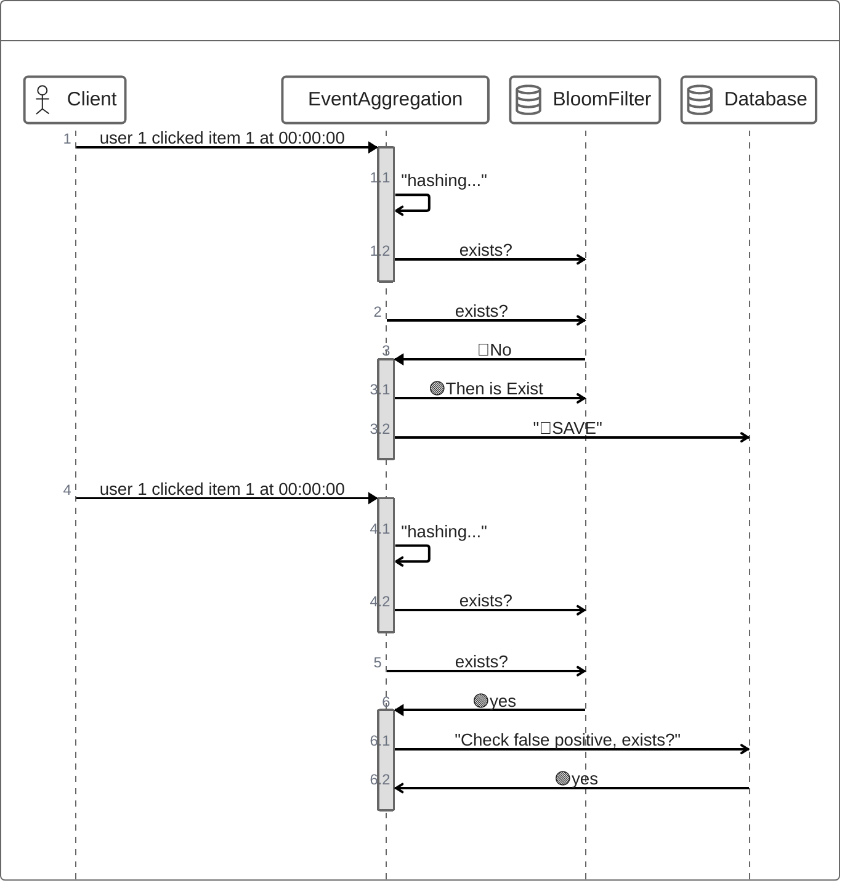

# 데이터 타입 활용

## Unique Events 
 - 동일 요청이 중복으로 처리되지 않기 위해 빠르게 해당 Item이 중복인지 확인하는 방법
 - 원본 데이터에 대한 조회 횟수를 줄일 수 있음
   - DB 부하를 줄이고, Redis의 빠른 처리속도를 가져갈 수 있음
### Bloom Filter를 사용하기 때문에, False Positive 를 주의!

