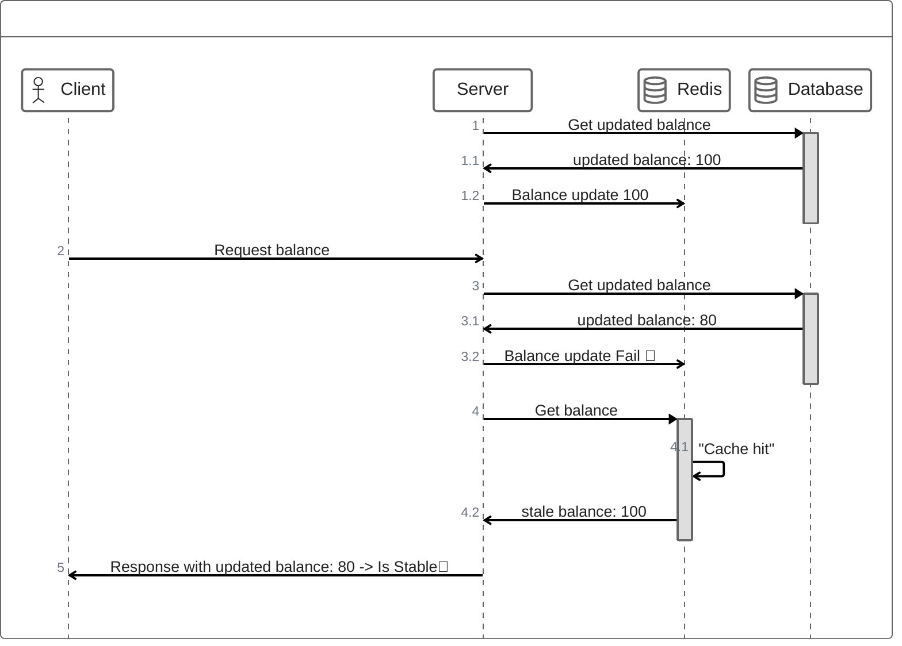

# 주의사항

## Stable Cache Invalidation
 - 캐시의 유효성이 손실되었거나 변경되었을 때 캐시를 삭제하는 기술
 - Stable Cache -> 오염된 캐시(잘못된 데이터)

## Two Hard Things
[링크](https://martinfowler.com/bliki/TwoHardThings.html)
 - 변수명 짓기랑 캐시 만료 기술이 가장 컴퓨터 공학에서 중요하다.

