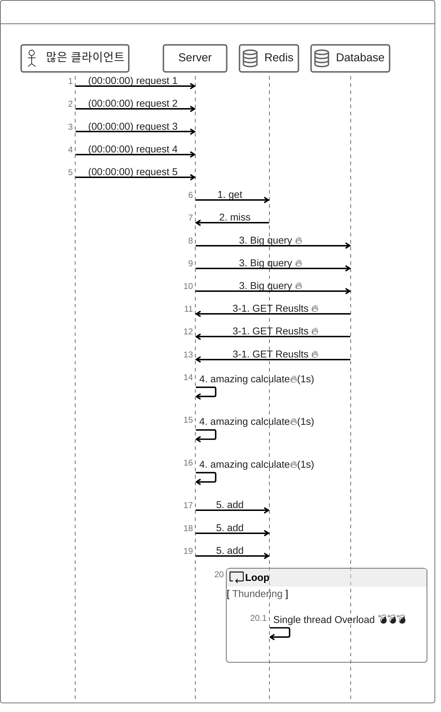

# 주의사항

## Thundering Herd Problem
 - 병렬 요청이 공유자원에 대해 접근 시도
   - 많은 리소스를 요구하는 통계 데이터 캐싱
   - 해당 통계데이터가 만료
   - 캐시미스로 DB 재 조회
   - 급격한 과부화 발생

Jitter 혹은 cron job으로 해당 캐시가 만료되지 않도록 설정

[해결방법](https://toss.tech/article/cache-traffic-tip)